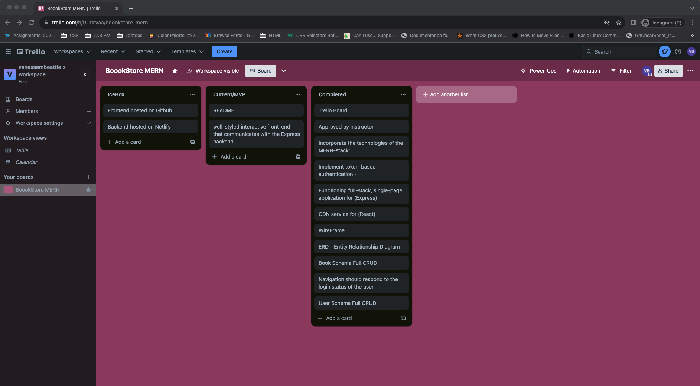
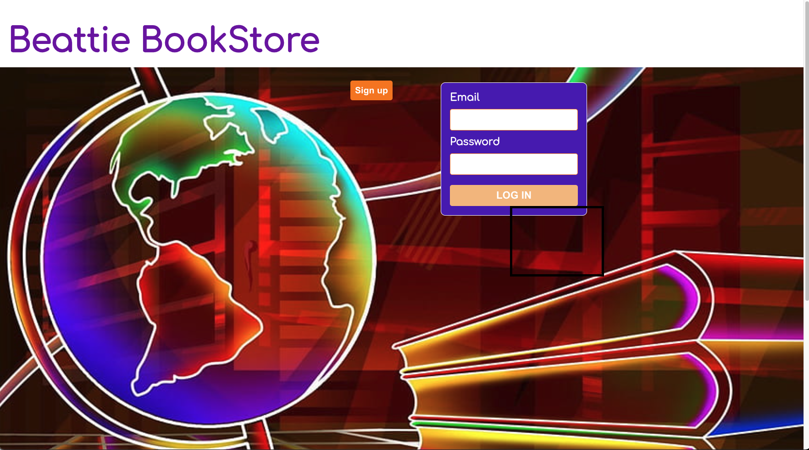
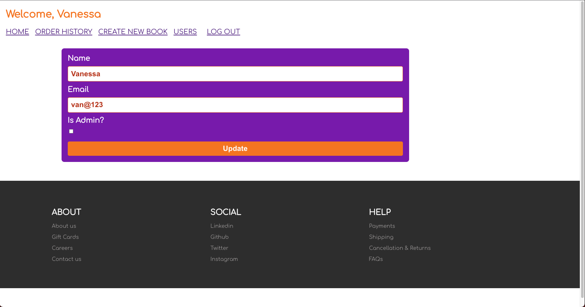

# Full Stack ONLINE BOOKSTORE Project using MERN

Render Live Version - [Beattie BookStore](https://online-bookstore-qja6.onrender.com)

### GitHub Live Version: (https://vanessaxb.github.io/OnlineBookstore/)

## Available Scripts

In the project directory, you can run:

### `npm start`

Runs the app in the development mode.\
Open [http://localhost:3000](http://localhost:3000) to view it in your browser.

## Technologies Used:
1. HTML               
2. CSS
3. JavaScript
4. React
5. Node JS
6. Express JS
7. MongoDb
8. Render

## Features:
1. User Authentication (Signup, Login and Logout)
2. Navigation responding to the login status of the user
3. New Orders Product Listing Page
4. Filter by Book Genre Categories   
5. Cart Management 
   - Add to cart 
   - Change items quantity in cart 
   - Remove from cart   
7. Single Product Page
8. History Order Summary 
9. Admin can update/delete User and also create/update/delete Book
10. Stripe payment Integration (to be implemented)
11. Custom Toast Component with 4 types - Success, Error, Warning and Information (to be implemented)

## Future Enhancements: 
- Filter books by Author, Reviews and Price

## Trello Board

## WireFrame

## Entity Relationship Diagram (ERD)

## Screenshots

### Home Page

### Product Listing Page

### User Authentication Pages

### Single Product Page

### Wishlist Page

### Cart Page

### Razorpay integration

### Orders Page
